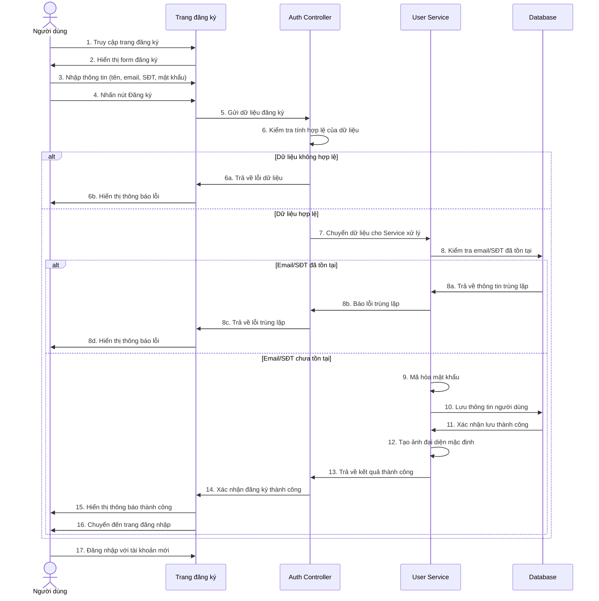

```mermaid
sequenceDiagram
    actor User as Người dùng
    participant RegForm as Trang đăng ký
    participant Controller as Auth Controller
    participant Service as User Service
    participant DB as Database
    
    User->>RegForm: 1. Truy cập trang đăng ký
    RegForm->>User: 2. Hiển thị form đăng ký
    User->>RegForm: 3. Nhập thông tin (tên, email, SĐT, mật khẩu)
    User->>RegForm: 4. Nhấn nút Đăng ký
    RegForm->>Controller: 5. Gửi dữ liệu đăng ký
    Controller->>Controller: 6. Kiểm tra tính hợp lệ của dữ liệu
    
    alt Dữ liệu không hợp lệ
        Controller->>RegForm: 6a. Trả về lỗi dữ liệu
        RegForm->>User: 6b. Hiển thị thông báo lỗi
    else Dữ liệu hợp lệ
        Controller->>Service: 7. Chuyển dữ liệu cho Service xử lý
        Service->>DB: 8. Kiểm tra email/SĐT đã tồn tại
        
        alt Email/SĐT đã tồn tại
            DB->>Service: 8a. Trả về thông tin trùng lặp
            Service->>Controller: 8b. Báo lỗi trùng lặp
            Controller->>RegForm: 8c. Trả về lỗi trùng lặp
            RegForm->>User: 8d. Hiển thị thông báo lỗi
        else Email/SĐT chưa tồn tại
            Service->>Service: 9. Mã hóa mật khẩu
            Service->>DB: 10. Lưu thông tin người dùng
            DB->>Service: 11. Xác nhận lưu thành công
            Service->>Service: 12. Tạo ảnh đại diện mặc định
            Service->>Controller: 13. Trả về kết quả thành công
            Controller->>RegForm: 14. Xác nhận đăng ký thành công
            RegForm->>User: 15. Hiển thị thông báo thành công
            RegForm->>User: 16. Chuyển đến trang đăng nhập
        end
    end
    
    User->>RegForm: 17. Đăng nhập với tài khoản mới
```
