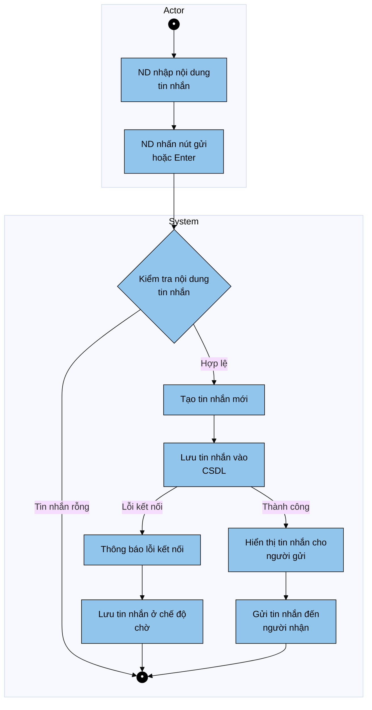

```mermaid
%%{init: { 'theme': 'base', 'themeVariables': { 'primaryBorderColor': '#aaaaaa', 'activityBorderColor': '#aaaaaa' } } }%%
flowchart TD
    subgraph Actor
        Start((•)) --> A1[ND nhập nội dung<br>tin nhắn]
        A1 --> A2[ND nhấn nút gửi<br>hoặc Enter]
    end
    
    subgraph System
        A2 --> B1{Kiểm tra nội dung<br>tin nhắn}
        B1 -->|Tin nhắn rỗng| Finish
        B1 -->|Hợp lệ| B2[Tạo tin nhắn mới]
        B2 --> B3[Lưu tin nhắn vào<br>CSDL]
        
        B3 -->|Lỗi kết nối| B4[Thông báo lỗi kết nối]
        B4 --> B5[Lưu tin nhắn ở chế độ<br>chờ]
        B5 --> Finish
        
        B3 -->|Thành công| B6[Hiển thị tin nhắn cho<br>người gửi]
        B6 --> B7[Gửi tin nhắn đến<br>người nhận]
        B7 --> Finish
        
        Finish((•))
    end
    
    classDef actorNode fill:#91c5eb,stroke:#000,stroke-width:1px,color:#000,border-radius:15px
    classDef systemNode fill:#91c5eb,stroke:#000,stroke-width:1px,color:#000,border-radius:15px
    classDef decisionNode fill:#91c5eb,stroke:#000,stroke-width:1px,color:#000,border-radius:0px
    classDef startEndNode fill:#000,stroke:none,color:#fff
    
    class A1,A2 actorNode
    class B2,B3,B4,B5,B6,B7 systemNode
    class B1 decisionNode
    class Start,Finish startEndNode
```
