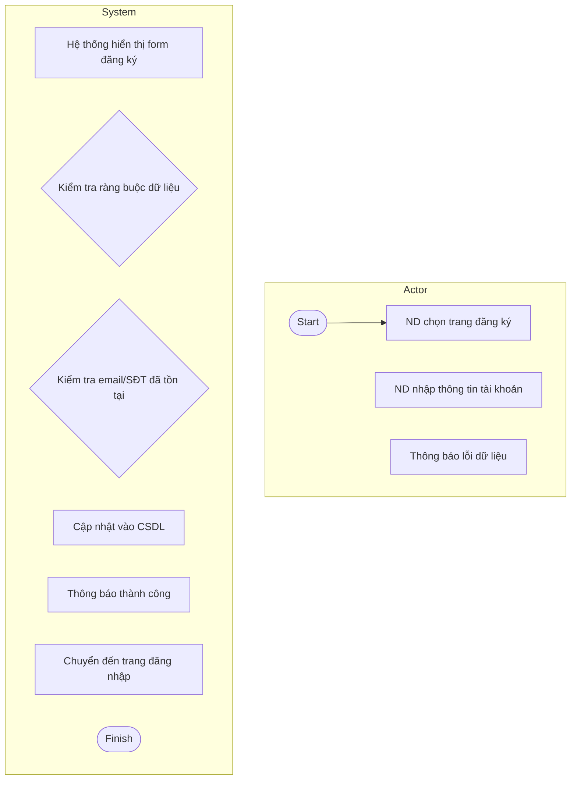

```mermaid
graph TD
    subgraph Actor
        Start([Start]) --> A1[ND chọn trang đăng ký]
        A3[ND nhập thông tin tài khoản]
        A5[Thông báo lỗi dữ liệu]
    end
    
    subgraph System
        B1[Hệ thống hiển thị form đăng ký]
        B3{Kiểm tra ràng buộc dữ liệu}
        B4{Kiểm tra email/SĐT đã tồn tại}
        B5[Cập nhật vào CSDL]
        B6[Thông báo thành công]
        B7[Chuyển đến trang đăng nhập]
        Finish([Finish])
    end
```
