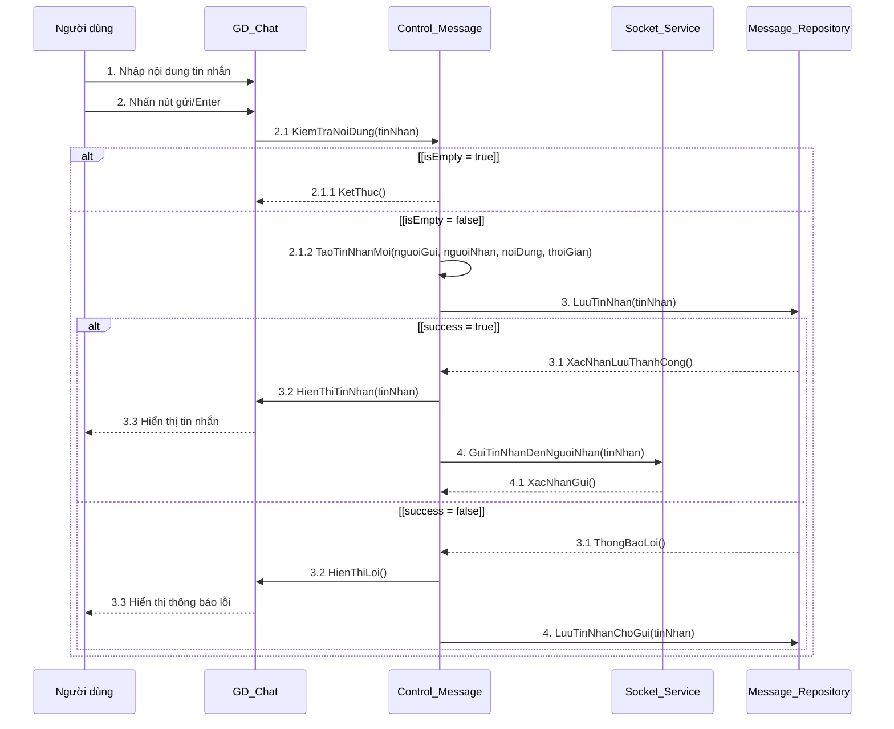

```mermaid
sequenceDiagram
    participant ND as Người dùng
    participant GD_Chat as GD_Chat
    participant Control_Message as Control_Message
    participant Socket as Socket_Service
    participant Message as Message_Repository
    
    ND->>GD_Chat: 1. Nhập nội dung tin nhắn
    ND->>GD_Chat: 2. Nhấn nút gửi/Enter
    GD_Chat->>Control_Message: 2.1 KiemTraNoiDung(tinNhan)
    
    alt [isEmpty = true]
        Control_Message-->>GD_Chat: 2.1.1 KetThuc()
    else [isEmpty = false]
        Control_Message->>Control_Message: 2.1.2 TaoTinNhanMoi(nguoiGui, nguoiNhan, noiDung, thoiGian)
        Control_Message->>Message: 3. LuuTinNhan(tinNhan)
        
        alt [success = true]
            Message-->>Control_Message: 3.1 XacNhanLuuThanhCong()
            Control_Message->>GD_Chat: 3.2 HienThiTinNhan(tinNhan)
            GD_Chat-->>ND: 3.3 Hiển thị tin nhắn
            Control_Message->>Socket: 4. GuiTinNhanDenNguoiNhan(tinNhan)
            Socket-->>Control_Message: 4.1 XacNhanGui()
        else [success = false]
            Message-->>Control_Message: 3.1 ThongBaoLoi()
            Control_Message->>GD_Chat: 3.2 HienThiLoi()
            GD_Chat-->>ND: 3.3 Hiển thị thông báo lỗi
            Control_Message->>Message: 4. LuuTinNhanChoGui(tinNhan)
        end
    end
```
