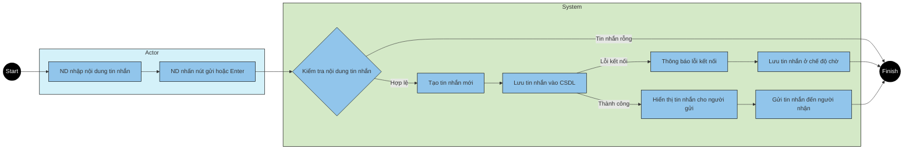

```mermaid
flowchart LR
    Start((Start)) --> A1
    
    subgraph Actor["Actor"]
        A1[ND nhập nội dung tin nhắn] --> A2
        A2[ND nhấn nút gửi hoặc Enter]
    end
    
    subgraph System["System"]
        B1{Kiểm tra nội dung tin nhắn}
        B2[Tạo tin nhắn mới]
        B3[Lưu tin nhắn vào CSDL]
        B4[Thông báo lỗi kết nối]
        B5[Lưu tin nhắn ở chế độ chờ]
        B6[Hiển thị tin nhắn cho người gửi]
        B7[Gửi tin nhắn đến người nhận]
    end
    
    A2 --> B1
    B1 -->|Tin nhắn rỗng| Finish
    B1 -->|Hợp lệ| B2
    B2 --> B3
    B3 -->|Lỗi kết nối| B4
    B4 --> B5
    B5 --> Finish
    B3 -->|Thành công| B6
    B6 --> B7
    B7 --> Finish
    
    Finish((Finish))
    
    classDef actorGroup fill:#d4f1f9,stroke:#000,stroke-width:1px
    classDef systemGroup fill:#d4e9c7,stroke:#000,stroke-width:1px
    classDef actorNode fill:#91c5eb,stroke:#000,stroke-width:1px
    classDef systemNode fill:#91c5eb,stroke:#000,stroke-width:1px
    classDef startEnd fill:#000,stroke:none,color:#fff
    
    class Actor actorGroup
    class System systemGroup
    class A1,A2 actorNode
    class B1,B2,B3,B4,B5,B6,B7 systemNode
    class Start,Finish startEnd
```
