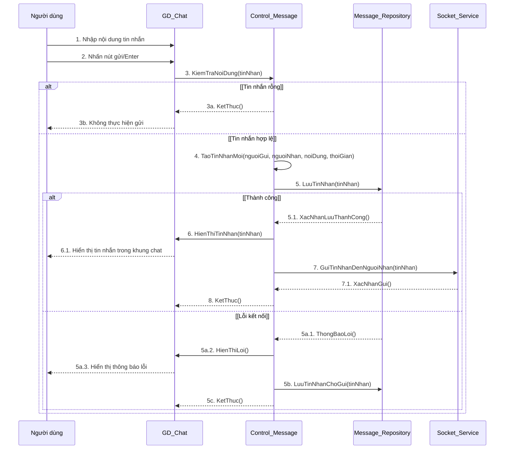

```mermaid
sequenceDiagram
    participant ND as Người dùng
    participant GD_Chat as GD_Chat
    participant Control_Message as Control_Message
    participant Message as Message_Repository
    participant Socket as Socket_Service
    
    ND->>GD_Chat: 1. Nhập nội dung tin nhắn
    ND->>GD_Chat: 2. Nhấn nút gửi/Enter
    GD_Chat->>Control_Message: 3. KiemTraNoiDung(tinNhan)
    
    alt [Tin nhắn rỗng]
        Control_Message-->>GD_Chat: 3a. KetThuc()
        GD_Chat-->>ND: 3b. Không thực hiện gửi
    else [Tin nhắn hợp lệ]
        Control_Message->>Control_Message: 4. TaoTinNhanMoi(nguoiGui, nguoiNhan, noiDung, thoiGian)
        Control_Message->>Message: 5. LuuTinNhan(tinNhan)
        
        alt [Thành công]
            Message-->>Control_Message: 5.1. XacNhanLuuThanhCong()
            Control_Message->>GD_Chat: 6. HienThiTinNhan(tinNhan)
            GD_Chat-->>ND: 6.1. Hiển thị tin nhắn trong khung chat
            Control_Message->>Socket: 7. GuiTinNhanDenNguoiNhan(tinNhan)
            Socket-->>Control_Message: 7.1. XacNhanGui()
            Control_Message-->>GD_Chat: 8. KetThuc()
        else [Lỗi kết nối]
            Message-->>Control_Message: 5a.1. ThongBaoLoi()
            Control_Message->>GD_Chat: 5a.2. HienThiLoi()
            GD_Chat-->>ND: 5a.3. Hiển thị thông báo lỗi
            Control_Message->>Message: 5b. LuuTinNhanChoGui(tinNhan)
            Control_Message-->>GD_Chat: 5c. KetThuc()
        end
    end
```
