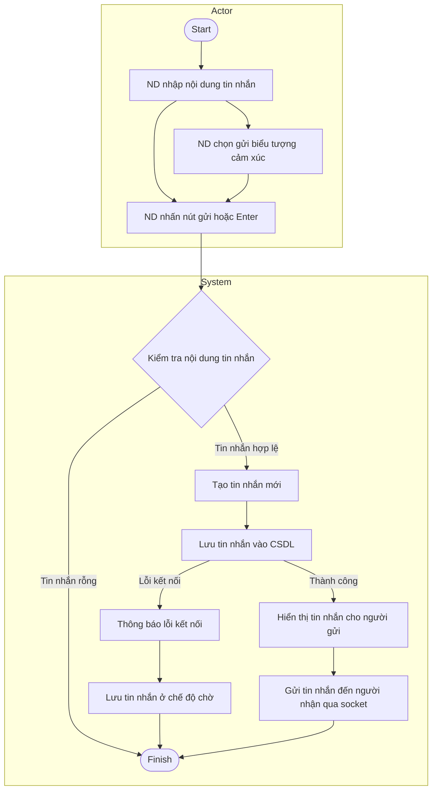

```mermaid
graph TD
    subgraph Actor
        Start([Start]) --> A1[ND nhập nội dung tin nhắn]
        A2[ND nhấn nút gửi hoặc Enter]
        A3[ND chọn gửi biểu tượng cảm xúc]
    end
    
    subgraph System
        B1{Kiểm tra nội dung tin nhắn}
        B2[Tạo tin nhắn mới]
        B3[Lưu tin nhắn vào CSDL]
        B4[Hiển thị tin nhắn cho người gửi]
        B5[Gửi tin nhắn đến người nhận qua socket]
        B6[Thông báo lỗi kết nối]
        B7[Lưu tin nhắn ở chế độ chờ]
        Finish([Finish])
    end
    
    A1 --> A2
    A1 --> A3
    A3 --> A2
    A2 --> B1
    B1 -->|Tin nhắn rỗng| Finish
    B1 -->|Tin nhắn hợp lệ| B2
    B2 --> B3
    B3 -->|Thành công| B4
    B3 -->|Lỗi kết nối| B6
    B6 --> B7
    B7 --> Finish
    B4 --> B5
    B5 --> Finish
```
