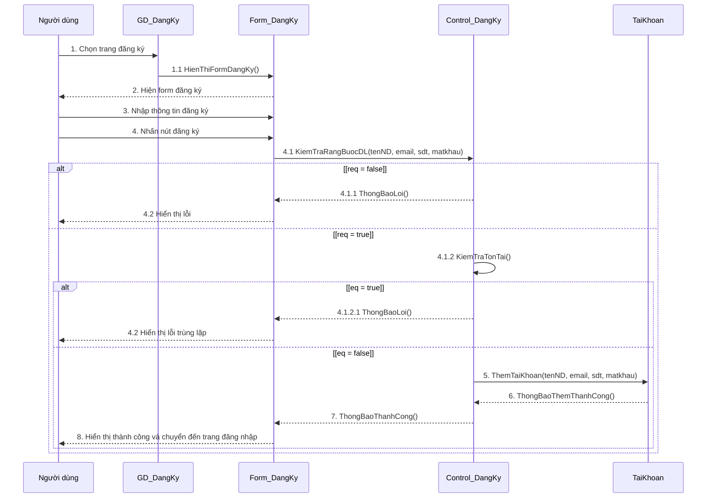

```mermaid
sequenceDiagram
    participant ND as Người dùng
    participant GD_DangKy as GD_DangKy
    participant Form_DangKy as Form_DangKy
    participant Control_DangKy as Control_DangKy
    participant TaiKhoan as TaiKhoan
    
    ND->>GD_DangKy: 1. Chọn trang đăng ký
    GD_DangKy->>Form_DangKy: 1.1 HienThiFormDangKy()
    Form_DangKy-->>ND: 2. Hiện form đăng ký
    ND->>Form_DangKy: 3. Nhập thông tin đăng ký
    ND->>Form_DangKy: 4. Nhấn nút đăng ký
    Form_DangKy->>Control_DangKy: 4.1 KiemTraRangBuocDL(tenND, email, sdt, matkhau)
    
    alt [req = false]
        Control_DangKy-->>Form_DangKy: 4.1.1 ThongBaoLoi()
        Form_DangKy-->>ND: 4.2 Hiển thị lỗi
    else [req = true]
        Control_DangKy->>Control_DangKy: 4.1.2 KiemTraTonTai()
        
        alt [eq = true]
            Control_DangKy-->>Form_DangKy: 4.1.2.1 ThongBaoLoi()
            Form_DangKy-->>ND: 4.2 Hiển thị lỗi trùng lặp
        else [eq = false]
            Control_DangKy->>TaiKhoan: 5. ThemTaiKhoan(tenND, email, sdt, matkhau)
            TaiKhoan-->>Control_DangKy: 6. ThongBaoThemThanhCong()
            Control_DangKy-->>Form_DangKy: 7. ThongBaoThanhCong()
            Form_DangKy-->>ND: 8. Hiển thị thành công và chuyển đến trang đăng nhập
        end
    end
```
